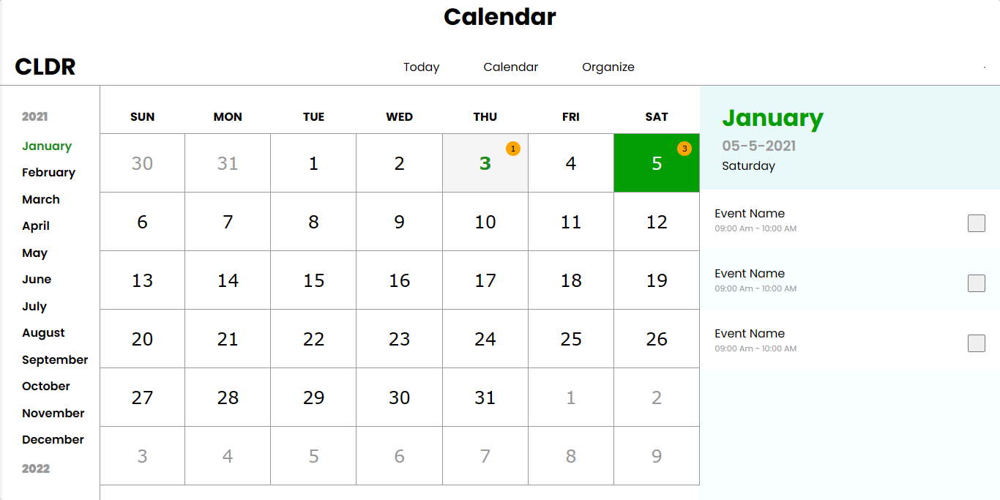

# Calendar App

## Description

The Calendar App is a user-friendly scheduling and task management tool designed to help you organize your daily activities effectively. With a clean and intuitive interface, it allows you to plan your tasks, view your schedule, and stay on top of your commitments.

**Note: This app is currently under construction. If you encounter any bugs or issues, please report them. Developers are welcome to contribute to this project to help enhance its functionality and stability.**

## Features

1. **Month View:** Explore an overview of all the months conveniently displayed on the left sidebar. Quickly navigate to your desired month by selecting it, making long-term planning a breeze.

2. **Date Selection:** In the middle section, effortlessly view and select dates for the chosen month. The selected date is highlighted, ensuring you always know which day you're working with.

3. **Current Date & Time:** On the right sidebar, you have easy access to the current date and time for reference, helping you stay oriented while scheduling your tasks.

4. **Task Scheduling:** Seamlessly schedule and manage your tasks for specific dates. Tasks corresponding to the selected date are displayed on the right side, making it simple to review your day's agenda.

## Usage

Using the Calendar App is straightforward:

- **Select Month:** Click on any month in the left sidebar to display the dates for that month in the middle section.

- **View Tasks:** On the right sidebar, you can see tasks scheduled for the selected date. This feature allows you to quickly access your plans for the day.

- **Schedule a Task:** To schedule a task, click on a date in the middle section. You can add, edit, or delete tasks for that date, helping you manage your commitments effectively.

## Screenshot

**Note: Include screenshot showcasing your app's interface here.**

## Technologies Used

- Vanilla JavaScript: The app is primarily built using vanilla JavaScript, demonstrating the power and flexibility of core web technologies.

- HTML & CSS: To structure the user interface and apply styling for a polished look.

## Contributing

Contributions to this project are welcomed! If you have ideas for enhancements, new features, or bug fixes, please follow these steps to contribute:

1. Fork this repository.
2. Create a new branch for your changes: `git checkout -b feature-name`
3. Make your changes and commit them: `git commit -m "Description of your changes"`
4. Push your changes to your fork: `git push origin feature-name`
5. Create a pull request to this repository.

Please ensure your code follows best practices and includes clear documentation for new features.

## License

This project is licensed under the [MIT License](./LICENSE). Feel free to use, modify, and distribute this application for your own purposes.

Enjoy the convenience of organized scheduling with the Calendar App!
